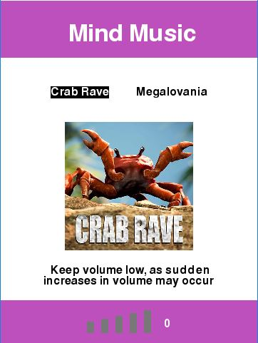
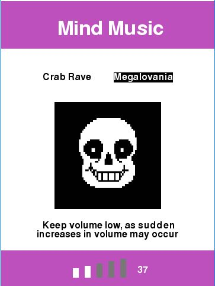

# EEG-Music-Player
An EEG application for brain-computer audio playing interface. Adjusts audio settings using facial muscle signals and electrically polarized eye signals

## Settings
Volume adjustment determined by upper facial expression synaptic wave amplitude. Audio source adjustment determined by muscle signals emitting from the frontalis muscle through the facial nerve.

## Interface
Plays either Noisestorm's 2018 hit *Crab Rave* or Toby Fox's 2015 Undertale soundtrack *Megalovania*

     
